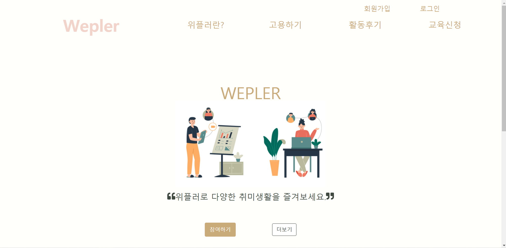
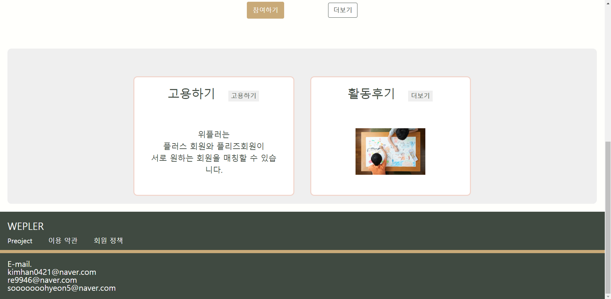
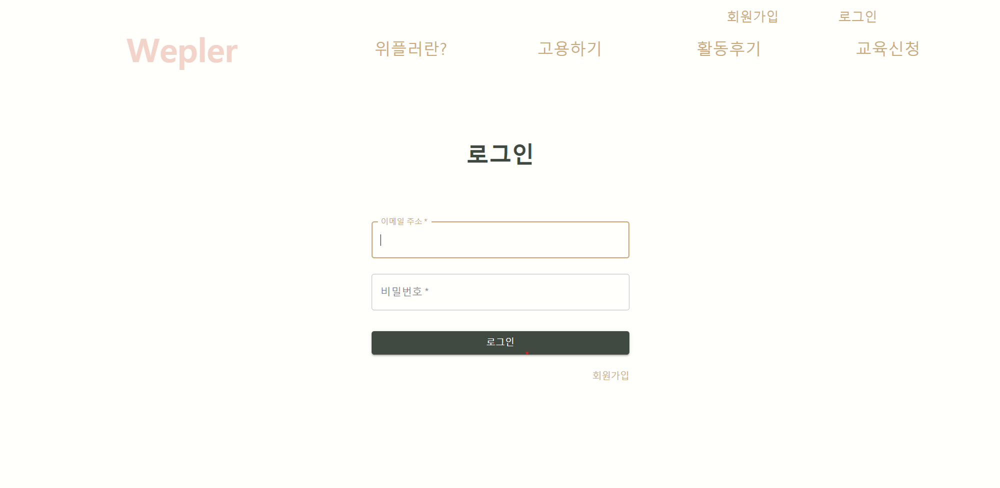
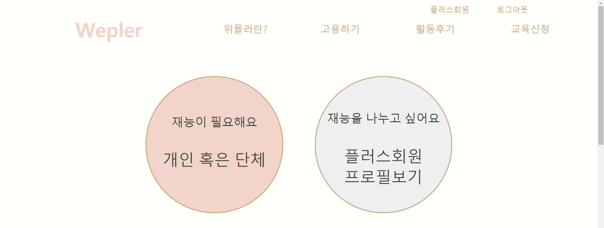
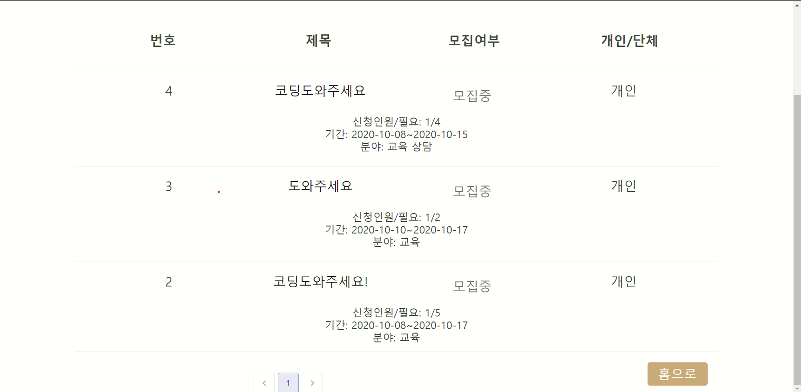
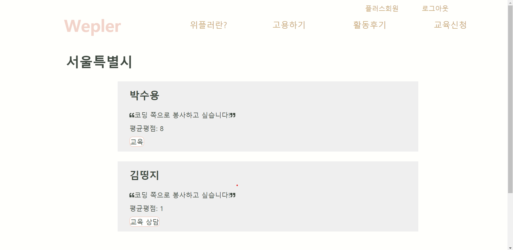
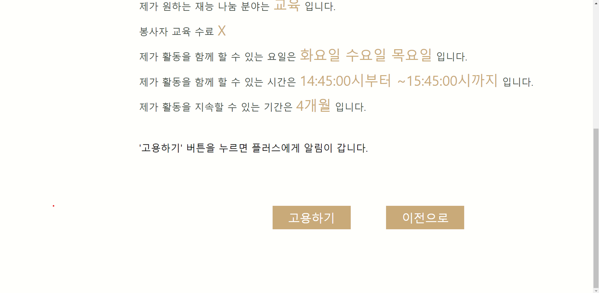

# Wepler project
한 줄 요약: 사회적 약자의 취미 활동을 위해 지역사회 사람들과 이어주는 서비스   
<string>Front-End : React </string>    
<string>Back-End : Django </string> 

### 아이디어의 장점

1. 사회적 약자를 돕는다는 웹서비스의 취지가 좋다.
2. 이 웹서비스를 통해서 세대차이가 완화될 수 있다.
3. 사회적 약자들이 주로 배우고 해왔던 정적인 활동에서 벗어나 동적인 활동까지 가능하게 된다.
4. 대학생들이 학과별로 장점을 살려 사회적 약자를 도울 수 있다.

### 아이디어의 단점

1. 수익성 → 중개수수료 & 가격이 비싸더라도 제대로 만들자!
2. 대학생이 사회적 약자를 가르칠 수 있는 자격이 있는가? → 활동 전 전문가를 통해 n시간 활동 이수 등 교육을 시킨다.
3. 악용 가능성이 있다. → 사회 복지 관련 인증서 등을 확인해 인증 절차를 강력하게 한다. 
4. 사회적 약자가 웹서비스 이용 가능한가? → 디자인을 사회적 약자가 접근하기 쉽도록 직관적이게 제작한다.
5. 중앙관리가 어려울 것 같다. → 정부 기관을 통해서 서비스를 중개하거나 전문 인력을 이용한다.
6. 시각장애인 분들은 웹서비스를 잘 이용할 수 있는가? → 전화, 글씨를 읽어주는 시스템을 사용한다. 그리고 시각장애인 분들은 개인적으로 웹에 있는 글씨를 읽어주는 프로그램을 사용한다고 함.
7. 지역, 거리 접근성 낮은 곳은? → 지역 사회의 대학생을 대상으로 한다. 
8. 봉사 단어 빼기 → 공강시간에 알바하자! '돈을 버는 서비스'

### 비슷한 플랫폼 조사
- 클래스101, 하비인더박스 → 원하는 취미를 집에서 할 수 있도록 재료를 제공하는 앱 서비스
> 다른 점 → 사용자에게 재료를 제공하는 것뿐만 아니라 함께 대학생이 취미 활동을 하며 시간을 보낸다는 점, 사회적 약자를 위한 서비스라는 점 

- 정부 주관 사업 → 사회적 약자를 위해 제공되는 서비스
> 다른 점 → 하고 싶은 내용으로 취미 생활을 즐길 수 있다는 점,  원하는 시간, 원하는 장소에서 취미 활동을 할 수 있다는 점 (집 밖을 나갈 수 없거나 나가는 걸 꺼리는 사회적 약자에게 도움이 됨)

---------
## Front-End & Back-End ) 사이트 MAP
#### 0. 공통
- 네브바 - 마이페이지
- 네브바 - 메뉴 바
#### 1. Wepler
- 1.1 /
#### 2. 위플러란?
- 2.1 /weplers
#### 3. 고용하기
- 3.1 /hire
    > 1. /areaplz
    > 2. 플리즈 회원이 플러스 회원을 고용하기 위한 페이지로 플러스 회원이 신청
- 3.2 재능 분류
- 3.3 개인 혹은 단체
- 3.4 플러스회원 프로필 보기
    > 1. /areaplus
    > 2. 플러스 회원의 프로필이 회원가입 시 자동 등록 됨(작성하기 버튼 없음)
    > 3. 지역 별 버튼
    > 4.  프로필 리스트 보기 /plusprofile
#### 4. 활동후기
- 4.1 /review   
- 4.2 플리즈-플러스 회원이 활동 완료 일 경우에만 작성 가능   
    > 1. 플리즈 회원 후기    
        - 플리즈 회원이 작성한 후기 보기/reviewplz   
        - 후기 자세히 보기/reviewplz/:postId   
    >   > ⇒ 플리즈 회원 + 작성자와 접속자의 이메일 같음 ) 수정, 삭제 가능   
        - 후기 작성하기/reviewplzwrite   
    >   > 플리즈 회원만 접근 가능   
    > 2. 플러스 회원 후기   
        - 플러스 회원이 작성한 후기 보기/reviewplus   
        - 후기 자세히 보기/reviewplus/:postId    
    >   > ⇒ 플러스 회원 + 작성자와 접속자의 이메일 같음 ) 수정, 삭제 가능   
        - 후기 작성하기/reviewpluswrite    
    >   > ⇒플러스 회원만 접근 가능   
#### 5. 교육신청 
- 5.1 /education
#### 6. 마이페이지
- 6.1 플러스 회원   
    > 6.1.1 기본정보/plusinfobasic    
    > 6.1.2 교육이수내역/plusactivityeud    
    > 6.1.3 활동내역    
    >   > 신청한 활동/plusapply     
    >   > 신청 받은 활동    
        - 플리즈 회원 리스트 보기/plusapplied     
        - 플리즈 회원 자세히 보기/plusapplied/:profileId    
    >   > 진행중     
        - 플리즈 회원 리스트 보기/plusactivitying     
        - 플리즈 회원 자세히 보기/plusactivitying/:profileId     
    >   > 활동완료 /plusactivitydone     
- 6.2 플리즈 회원     
    > 6.2.1 기본정보/plzinfobasic     
    > 6.2.2 활동내역    
    - 신청한 활동
    >   > 신청 받은 활동      
        - 플러스 회원 리스트 보기/plzapplied    
        - 플러스 회원 자세히 보기/plzapplied/:profileId     
    >   > 진행중/plzactivitying   
        - 플러스 회원 리스트 보기/plzactivitying    
        - 플러스 회원 자세히 보기/plzactivitying/:profileId    
    >   > 활동완료/plzactivitydone    

 

---------

## 이미지

- 메인

- 로그인

- 서비스 선택

- 신청 게시판

- 신청 현황

